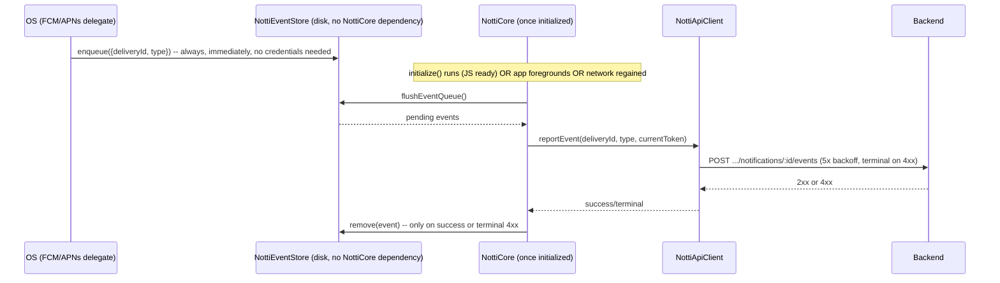

# CTR Event Reporting Design

**Spec**: `.specs/features/ctr-event-reporting/spec.md`
**Status**: Draft

---

## Architecture Overview

The hard constraint driving this design: **detection must not depend on `NottiCore`/`activeCore` existing.**
`NottiModule.activeCore` (Android) / `NottiImpl.activeCore` (iOS) are both `null` until the JS
`initialize()` call runs — which is exactly when a cold-start click needs to be captured (before the
JS bundle has even finished evaluating). This is the same problem `NottiNotificationClickRelay`
(Android) / `NottiEventBuffer` (iOS) already solved for the **JS-facing** event, by buffering
independent of any live emitter. This design applies the identical pattern one layer down, for the
**HTTP-facing** report: a new, `NottiCore`-independent disk queue (`NottiEventStore`) is written to
directly from the OS-level detection points, and only *flushed* (turned into actual HTTP calls) once
`NottiCore` has real credentials (`appId`/`clientKey`/`baseUrl`) — i.e., after `initialize()` has run
at least once in this process.



---

## Code Reuse Analysis

### Existing Components to Leverage

| Component | Location | How to Use |
| --- | --- | --- |
| `NottiApiClient.executeWithRetry` | `android/NottiApiClient.kt:129-171` | Extracted into a generic `<T> executeWithRetry(request, parseSuccess: (String) -> T?)`, reused by both the existing device methods (`T = DeviceResponse`) and the new `reportEvent` (`T = Unit`) — same 5-attempt exponential-backoff/terminal-4xx logic, not reimplemented. |
| `NottiDeviceStore` pattern (SharedPreferences-backed, scalar+small-collection state) | `android/NottiDeviceStore.kt` | Directly mirrored by the new `NottiEventStore` — same `SharedPreferences` approach, own pref file (`notti_events`), since it's a small bounded list, no query needs. |
| `NottiNotificationClickRelay` / `NottiEventBuffer`'s "buffer until something exists" pattern | `android/NottiNotificationClickRelay.kt`, `ios/NottiEventBuffer.swift` | Conceptually reused, not code-shared: same problem (cold-start, nothing attached yet), solved the same way (static/singleton buffer independent of the thing that isn't ready yet) — but for disk persistence + later HTTP flush, not JS emission. |
| `NottiForegroundObserver` (`ProcessLifecycleOwner` observer) | `android/NottiInitProvider.kt:80-84` | Extended: `onStart` already calls `NottiModule.activeCore?.onAppForegrounded()` — this becomes the "flush on app launch/foreground" trigger (SDKCTR-12) by having `onAppForegrounded()` also call the new `flushEventQueue()`. |
| `NottiInitProvider`'s zero-integration `ContentProvider` hook | `android/NottiInitProvider.kt:28-50` | New network-connectivity observer registered here too, alongside `NottiActivityLifecycleListener.registerOnce`/`ProcessLifecycleOwner` — same "no integrator code" mechanism. |
| `registerDevice`'s `flushPendingMutations()` call on successful registration | `android/NottiCore.kt:226-227` | `flushEventQueue()` added right alongside it — the moment credentials+device id are confirmed is also the moment a cold-start-buffered event first becomes flushable. |
| `NottiApiClient`'s injectable `sleeper`/test pattern | `android/NottiApiClient.kt:31`, mirrored on iOS | Reused unchanged for `reportEvent`'s retry tests — no new test infrastructure needed. |
| `parseRemoteMessage`/`parseUserInfo`'s already-parsed `data: Map<String,String>` | `android/NottiFirebaseMessagingService.kt:11-15`, `ios/NottiNotificationParsing.swift` | `notification_id`/`delivery_id` are read straight out of this existing map — no new parsing path, just two known keys checked for presence. |

### Integration Points

| System | Integration Method |
| --- | --- |
| Backend `POST /v1/apps/{app_id}/notifications/{notification_id}/events` | New `NottiApiClient.reportEvent` method, same `Authorization: Bearer <clientKey>` header every other call already sends. |
| Android `ConnectivityManager` | New `NottiNetworkObserver` (`registerDefaultNetworkCallback`, available since API 24 — this SDK's `minSdkVersion`, no compat shim needed), registered once from `NottiInitProvider.onCreate`. |
| iOS `NWPathMonitor` (Network framework) | New `NottiNetworkObserver.swift` equivalent, started once from wherever `NottiPushDelegate.shared`/`NottiBridge` static setup already happens. |
| `NottiCore` | Gains `flushEventQueue()` (Kotlin) / `flushEventQueue()` (Swift), called from `registerDevice` success, `onAppForegrounded()`, and the new network-observer's "became available" callback. |

---

## Components

### `NottiEventStore` (new — Android: `android/src/main/java/com/notti/NottiEventStore.kt`, iOS: `ios/NottiEventStore.swift`)

- **Purpose**: Disk-persisted, `NottiCore`-independent queue of not-yet-confirmed `received`/`clicked` events. Exists so detection (which can happen before any credentials/registration exist) is never blocked on or lost to the absence of a live `NottiCore`.
- **Location**: `android/src/main/java/com/notti/NottiEventStore.kt` (object or class wrapping its own `SharedPreferences("notti_events", ...)`), `ios/NottiEventStore.swift` (class wrapping `UserDefaults` with its own suite, mirroring `NottiDeviceStore.swift`'s approach)
- **Interfaces**:
  - `enqueue(notificationId: String, deliveryId: String, type: String): PendingEvent` — writes immediately, assigns a local id, returns the stored record
  - `all(): List<PendingEvent>` — every not-yet-removed event, in insertion order
  - `remove(id: String)` — called only after a 2xx or a terminal 4xx
- **Dependencies**: `SharedPreferences`/`UserDefaults` only — explicitly NOT `NottiCore`, `NottiApiClient`, or `NottiDeviceStore`
- **Reuses**: `NottiDeviceStore`'s persistence style (simple key-value, JSON-encoded collection for the list, same as how `NottiDeviceStore` encodes tags)

**`PendingEvent`**:

```kotlin
data class PendingEvent(
  val id: String,           // local UUID, never sent to the backend
  val notificationId: String,
  val deliveryId: String,
  val type: String,         // "received" | "clicked"
  val createdAtMs: Long
)
```

No cap is placed on queue size beyond what `spec.md`'s Edge Cases already flags as a Design-deferred decision — see Tech Decisions below for why a generous fixed cap (mirroring `NottiCore.MAX_PENDING_MUTATIONS`) is still the right default even though the spec left it open.

### `NottiApiClient.reportEvent` (modify existing — `android/NottiApiClient.kt`, `ios/NottiApiClient.swift`)

- **Purpose**: POST one event to the backend, with the same retry/backoff/terminal-4xx behavior every other `NottiApiClient` call already has.
- **Location**: Same file as the existing `createOrUpdateDevice`/`patchDevice` — this is a third method on the same class, not a new type (it needs the same `httpClient`/`baseUrl`/`appId`/`clientKey`/`sleeper` the class already holds).
- **Interfaces**:
  - `fun reportEvent(notificationId: String, deliveryId: String, type: String, token: String): EventResult` — `EventResult` is a new minimal sealed class (`Success` / `Failure(message: String)`), distinct from `ApiResult` (which carries a `DeviceResponse` this call doesn't have).
- **Dependencies**: Same `OkHttpClient`/`jsonMediaType` fields already on the class.
- **Reuses**: The retry loop itself — refactored to a generic `private fun <T> executeWithRetry(request: Request, parseSuccess: (String) -> T?): Result<T>` (naming TBD at implementation time) so `createOrUpdateDevice`/`patchDevice`/`reportEvent` all share one retry implementation instead of three.

**Request shape** (matches the backend `ctr-tracking` design.md's contract exactly):

```
POST {baseUrl}/v1/apps/{appId}/notifications/{notificationId}/events
Authorization: Bearer {clientKey}

{ "delivery_id": "...", "type": "received" | "clicked", "token": "..." }
```

Any 2xx is success (no response body is needed — unlike device registration, there is no id to persist back), matching `patchDevice`'s "any 2xx is accepted" tolerance rather than registration's "must parse a device object" strictness, since this call creates nothing the SDK needs to remember.

### `NottiCore.flushEventQueue` (modify existing — `android/NottiCore.kt`, `ios/NottiCore.swift`)

- **Purpose**: Drain `NottiEventStore`, attempt to report each pending event, remove on success/terminal-4xx.
- **Location**: New private method on the existing `NottiCore` class.
- **Interfaces**:
  - `private fun flushEventQueue()` — no public/JS-visible signature (AD-001, no new JS API)
- **Dependencies**: `apiClient` (must be non-null — skip entirely if `initialize()` hasn't run yet), `deviceStore.getLastToken()` (must be non-null — skip if the device has never completed registration; the next successful registration's own `flushEventQueue()` call, per the Integration Points table, will retry it)
- **Reuses**: `dispatch(...)` (hands the work to the existing single-threaded `executor`, same crash-safety wrapper every other `NottiCore` entry point already uses)

**Call sites** (all three, per spec's flush triggers):

1. End of `registerDevice`'s `ApiResult.Success` branch, alongside the existing `flushPendingMutations()` call (`NottiCore.kt:227`)
2. `onAppForegrounded()`, unconditionally (unlike registration's own resume logic, an event flush doesn't need the `RegistrationState` guard — it's idempotent to attempt and a no-op if the queue is empty)
3. The new network-observer's "connectivity regained" callback

### `NottiEventDetector` hookup (modify existing detection sites, no new class)

Rather than a new component, this is a one-line addition at each of the three existing detection
call sites — deliberately kept inline rather than factored into a shared helper, since the three
sites differ in what they have on hand (a `RemoteMessage` vs. an `Intent` vs. a `UNNotification`)
and the actual logic is one `if` + one `enqueue` call:

| Site | File | Existing call | Addition |
| --- | --- | --- | --- |
| Android foreground receive | `NottiFirebaseMessagingService.onMessageReceived` | `NottiModule.emitNotificationReceived(remoteMessage)` | `parseRemoteMessage(remoteMessage).data` → if both ids present, `NottiEventStore.enqueue(...)`, then `NottiModule.activeCore?.flushEventQueue()` opportunistically (a no-op if `apiClient` is null, but avoids waiting for the next foreground/network trigger when the app is already alive and online) |
| Android click (any app state) | `NottiActivityLifecycleListener` around its existing `NottiNotificationClickRelay.emit(parsed)` call (`:119`) | (same line) | Same pattern: check `parsed.data`, enqueue, opportunistic flush attempt |
| iOS foreground receive | `NottiPushDelegate.willPresent` | `NottiEventBuffer.shared.emit(.received, ...)` | Same pattern, using `parsed.toEventPayload()`'s underlying data dictionary |
| iOS click (any app state) | `NottiPushDelegate.didReceive response:` (after the default-action/remote-push guard) | `NottiEventBuffer.shared.emit(.clicked, ...)` | Same pattern |

---

## Data Models

### `PendingEvent` (new, per-platform local struct — not sent over the wire as-is)

See `NottiEventStore` component above for the Kotlin shape; the Swift equivalent:

```swift
struct PendingEvent: Codable {
  let id: String
  let notificationId: String
  let deliveryId: String
  let type: String // "received" | "clicked"
  let createdAtMs: Int64
}
```

**Relationships**: Ephemeral/local-only — never persisted server-side under this shape; `notificationId`/`deliveryId`/`type` map directly onto the backend's `POST .../events` request body (`token` is added at flush time, not stored, since the current token can change between enqueue and flush — see Edge Cases in spec.md).

### `EventResult` (new, per-platform, mirrors `ApiResult`)

```kotlin
sealed class EventResult {
  object Success : EventResult()
  data class Failure(val message: String) : EventResult()
}
```

**Relationships**: Return type of `NottiApiClient.reportEvent`, consumed only by `NottiCore.flushEventQueue`.

---

## Error Handling Strategy

| Error Scenario | Handling | User Impact |
| --- | --- | --- |
| `notification_id`/`delivery_id` absent from `data` | Detection site skips `enqueue` entirely | None — not an error, per spec's Out-of-Scope skip rule |
| `reportEvent` returns a network error or 5xx | `executeWithRetry`'s existing 5-attempt backoff runs; event stays in `NottiEventStore` throughout | None visible; event flushes on the next trigger if all 5 attempts fail |
| `reportEvent` returns any 4xx | Terminal — `flushEventQueue` removes the event from `NottiEventStore` without further retry, same classification `executeWithRetry` already applies to device calls | None — this is an accepted, permanent miss (e.g. stale token per spec's Edge Cases), not surfaced to the integrator (matches the existing `logger`-only failure reporting on `login`/`setSubscription`/etc.) |
| `flushEventQueue` runs before `initialize()` (network observer fires very early, or a stray foreground before JS ever calls `initialize()`) | `apiClient == null` → early return, no-op | None — the event stays queued for the next trigger |
| `flushEventQueue` runs after `initialize()` but device registration itself is still failing (`deviceStore.getLastToken() == null`) | Early return, no-op | None — same as above; the successful-registration call site (Integration Points table, item 1) is what eventually flushes it |
| `NottiEventStore` grows unbounded (device offline for a very long time) | Bounded to a fixed cap (see Tech Decisions), oldest dropped first, same policy as `NottiCore.MAX_PENDING_MUTATIONS` | A very old, very offline device silently loses its oldest queued engagement events rather than growing local storage indefinitely — no crash, no user-visible error |

---

## Tech Decisions (only non-obvious ones)

| Decision | Choice | Rationale |
| --- | --- | --- |
| Persistence independent of `NottiCore` | `NottiEventStore` has zero dependency on `NottiCore`/`apiClient`/`NottiDeviceStore` | The whole point is surviving the window where `activeCore` is `null` (cold-start click, pre-`initialize()`) — a store that required `NottiCore` to exist would reintroduce the exact gap `NottiNotificationClickRelay`/`NottiEventBuffer` already exist to close, one layer up. |
| First disk-persisted retry queue in this SDK | New, distinct from `NottiCore.pendingMutations` (in-memory only, explicitly documented as "dropped on process death rather than replayed later with stale state", `NottiCore.kt:98-102`) | `pendingMutations` holds *current-state* mutations (a tag value, a subscription flag) where a stale replay after process death could overwrite newer state with old intent — genuinely risky to persist. An engagement event (`user clicked at time T`) is an immutable historical fact with no "staleness" risk; replaying it after a restart is always still correct. The two queues solve different problems and are allowed to have different persistence guarantees. |
| Token is read at flush time, not stored in `PendingEvent` | `NottiEventStore` never stores a token | Per spec's own Edge Cases: a token refresh between enqueue and flush should surface as the standard terminal-403 path, not a value frozen at enqueue time that's already known stale. |
| Opportunistic flush at enqueue time, in addition to the three spec'd triggers | Added at each detection site (see hookup table) | Not spec-required, but free: if the app is already alive and `NottiCore` is initialized (the common case — most receives/clicks happen with the app already running), there's no reason to wait for the next foreground/network event when the flush call is one line and a no-op otherwise. |
| Queue size cap | Reuse `NottiCore.MAX_PENDING_MUTATIONS`'s exact value (32) and oldest-dropped-first policy | Spec left the exact cap as a Design-phase decision (Edge Cases: "exact backpressure/cap strategy is a Design-phase decision"); reusing the existing constant/policy avoids inventing a second magic number with no stronger justification than the first one already has. |
| `reportEvent`'s success handling needs no response body | Any 2xx = success, body ignored | Unlike registration (needs the returned device `id`), this call creates nothing the client must remember — mirrors `patchDevice`'s "any 2xx is accepted" tolerance, not `createOrUpdateDevice`'s strict parse. |
| iOS `NWPathMonitor` vs. `NottiForegroundObserver`-style reuse | Separate new observer, not folded into the existing foreground observer | Network regaining connectivity and the app coming to the foreground are genuinely different signals (app can be foregrounded while still offline, or regain network while backgrounded) — spec's SDKCTR-13 explicitly requires the network-regained trigger independent of a foreground event. |

---

## Open Questions for Tasks Phase

None — every P1/P2 acceptance criterion in spec.md maps to a component above. Exact `SharedPreferences`/`UserDefaults` key names and the generic-retry refactor's exact signature are implementation details, not design decisions.
