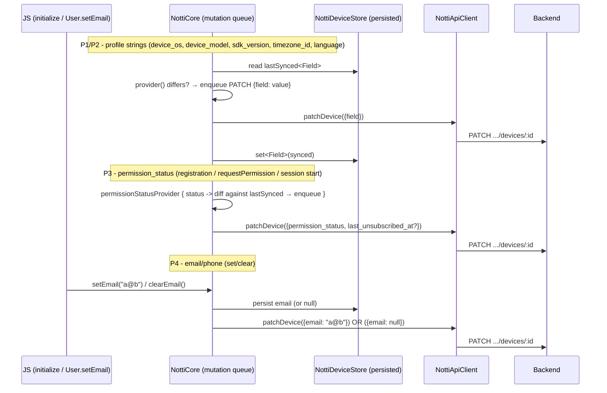

# Device Profile Fields Design (SDK)

**Spec**: `.specs/features/device-profile-fields/spec.md`
**Status**: Draft

---

## Architecture Overview

The feature is native-only device-state bookkeeping on both platforms, synced through the **existing
device PATCH mutation-queue path** (`NottiCore`'s `pendingMutations`/`performOrQueue`) — no new
transport. Four stories share that single pipeline, exactly like `segment-telemetry-reporting`:

- **P1 (device_os / device_model / sdk_version)**: static values read once per launch (natively for
  OS/model; `sdk_version` passed from JS at `initialize`), diffed against last-synced values, enqueued
  as PATCH only on change — the exact `syncAppVersionIfNeeded` pattern extended to sibling fields.
- **P2 (timezone_id / language)**: same read-once-at-init, diff-and-enqueue pattern; values come from
  `TimeZone`/`Locale` (Android) and `TimeZone`/`Locale` (iOS).
- **P3 (permission_status / last_unsubscribed_at)**: the OS's push-permission state read as an enum
  string, kept in sync at registration, `requestPermission` result and each session start (catches
  Settings changes while the app wasn't running); `last_unsubscribed_at` recorded on the true→false /
  granted→denied transition. Two-axis: `subscribed` (app-controlled bool) stays independent.
- **P4 (email / phone)**: JS `User.setEmail/clearEmail/setPhone/clearPhone` → native mutate →
  PATCH, with explicit `null` clear. First-class fields, never merged into tags.

The critical constraint driving the design is unchanged from `segment-telemetry-reporting`:
**`NottiCore` has no `Context`/app-visible state** — every platform read comes in as a
constructor-injected closure. `permission_status` is the one new closure that is async (iOS's
`UNUserNotificationCenter.getNotificationSettings` is callback-based), so it follows the
`countryProvider` callback shape, not `versionProvider`'s synchronous getter.



---

## Code Reuse Analysis

### Existing Components to Leverage

| Component | Location | How to Use |
| --- | --- | --- |
| `pendingMutations` + `mutate()`/`performOrQueue` (diff-and-enqueue mutation queue) | `android/NottiCore.kt:780-817`, `ios/NottiCore.swift:981-1011` | The single pipeline all four stories PATCH through. Each profile field is a new `PendingMutation` with its own `coalesceKey`, identical shape to `appVersion`. |
| `syncAppVersionIfNeeded()` | `android/NottiCore.kt:828-849`, `ios/NottiCore.swift:589-602` | The exact template for P1/P2: read provider → diff against `deviceStore` last-synced → `mutate(..., coalesceKey)` → persist on Success. Generalize into `syncProfileFieldsIfNeeded()` covering all six strings. |
| `NottiApiClient.patchDevice(deviceId, token, fields)` | `android/NottiApiClient.kt:102-146`, `ios/NottiApiClient.swift:153-184` | Open `Map`/`[String: Any]` of fields, always adds `token` (AD-009). New keys need zero transport changes. |
| Raw-JSON null support | `android/NottiApiClient.kt:176-185` (`toJsonValue(null)` → `JSONObject.NULL`), iOS `JSONSerialization` handles `NSNull` | `email: null`/`phone: null` (P4 clear) serialize correctly on both platforms — same three-state technique the backend companion spec requires. |
| `NottiDeviceStore`/`NottiDeviceStore.swift` | `android/NottiDeviceStore.kt`, `ios/NottiDeviceStore.swift` | Extended with the new persisted fields (last-synced profile strings, permission status, `last_unsubscribed_at`, email/phone). Same `notti_prefs`/UserDefaults store. |
| `permissionRequester`/`requestPermission` | `android/NottiCore.kt:597-628`, `ios/NottiCore.swift:310-342` | P3 hooks the `requestPermission` result to also sync the new `permission_status`, alongside the existing `subscribed` PATCH. |
| `readCountryIfOptedIn()`/`readCountryIfEnabled()` (session-start async provider) | `android/NottiCore.kt:455-473`, `ios/NottiCore.swift:859-872` | Template for the async `permissionStatusProvider` read at session start: fire provider, hop onto executor/workQueue, diff, enqueue. |
| `countryClearMutation()` / `attemptPendingCountryClear()` (explicit-null clear mutation) | `android/NottiCore.kt:733-760`, `ios/NottiCore.swift:905-926` | Template for P4's `email: null`/`phone: null` clear, though email/phone need no persisted pending-clear obligation (see Tech Decisions). |
| JS facade `User` object + `NativeNotti.ts` Spec | `src/index.tsx:25-45`, `src/NativeNotti.ts` | P4 adds four Spec methods + `User` wrappers, mirroring the existing `addTag`/`removeTag` shape. P1's `sdk_version` adds a parameter to `initialize`. |
| `buildPatchJson` (Android) | `android/NottiApiClient.kt:231-237` | Already serializes composite values correctly; new scalar string/null fields need no change. |

### Integration Points

| System | Integration Method |
| --- | --- |
| PATCH device endpoint | Existing `patchDevice` — new keys additive; backend companion spec (DPROF-01..17) accepts them; "SDK ships first" edge case tolerated (unknown fields ignored). |
| Backend segment fields | SDK only produces data; filtering is `device-profile-fields` (backend) P2, out of scope here. |
| `sdk_version` | Read in JS from the package's own `exports` (`./package.json` → `require('react-native-notti/package.json').version` at bundle time) and passed through `NativeNotti.initialize(appId, clientKey, baseUrl, sdkVersion)`. |
| OS version / model | Injected `deviceOsProvider`/`deviceModelProvider`: Android `Build.VERSION.RELEASE`/`Build.MODEL`, iOS `UIDevice.current.systemVersion`/`utsname.machine`. |
| Timezone / language | Injected `timezoneProvider`/`languageProvider`: Android `TimeZone.getDefault().id`/`Locale.getDefault().language`, iOS `TimeZone.current.identifier`/`Locale.current.languageCode`. |
| Push permission status | Injected async `permissionStatusProvider(callback)`: Android `NotificationManagerCompat.areNotificationsEnabled()` + API 33 `POST_NOTIFICATIONS` check; iOS `UNUserNotificationCenter.getNotificationSettings` → `authorizationStatus`. |

---

## Components

### Generalization: `syncProfileFieldsIfNeeded()` (both platforms)

- **Purpose**: replace `syncAppVersionIfNeeded` with a loop over every read-once profile field — each diffed against its own last-synced store value and enqueued independently on change.
- **Location**: `android/NottiCore.kt` (extend existing method), `ios/NottiCore.swift` (same). Called from `registerDevice` success after `flushPendingMutations`.
- **Interfaces**:
  - New injected providers: `deviceOsProvider: () -> String?`, `deviceModelProvider: () -> String?`, `sdkVersionProvider: () -> String?`, `timezoneProvider: () -> String?`, `languageProvider: () -> String?` (defaults `{ null }` — no-op, same as `versionProvider`).
  - `deviceStore` last-synced accessors per field.
- **Dependencies**: `NottiDeviceStore` new fields, providers.
- **Reuses**: `mutate`/`performOrQueue` + `patchDevice` + coalesce keys.
- **Behavior**: for each of the six fields (including `app_version`): `provider()?.let { cur -> if (cur != store.getLastSynced<Field>()) mutate("<field>", coalesceKey) { client, id, token -> patchDevice(id, token, mapOf("<field>" to cur)); on Success -> store.setLastSynced<Field>(cur) } }`. Opaque strings, no parsing (DPF-01..05, 06..09). Read failure (`null`) skips that field only.

### P1 — `sdk_version` threading (JS → native)

- **Purpose**: single source of truth for the SDK version, read from the package manifest, passed to native `initialize`.
- **Location**: `src/index.tsx` (`initialize` reads the version and forwards), `src/NativeNotti.ts` (Spec signature), `android/NottiModule.kt:187-189` + `NottiCore.kt:220` (accept `sdkVersion`), `ios/NottiImpl.swift:264-267` + `NottiCore.swift:297` (same).
- **Interfaces**: `initialize(appId, clientKey, options)` public signature unchanged for integrators; internally JS reads the package version and passes it as the native 4th argument.
- **Dependencies**: package.json `version` (readable via the existing `./package.json` export), `NottiCore` field to hold it (passed into `sdkVersionProvider`).
- **Reuses**: the existing `initialize` chain; no new transport.
- **Behavior**: JS resolves the version once at module load and passes it on every `initialize` call; native stores it and treats it as a normal diffed profile field (DPF-01..04). If resolution fails, `sdkVersionProvider()` returns `null` and the field is omitted (DPF edge case).

### P3 — `permission_status` sync (both platforms)

- **Purpose**: keep the OS push-permission state synced as a first-class enum, independent of `subscribed`.
- **Location**: `android/NottiCore.kt`, `ios/NottiCore.swift`; injected provider wired in `NottiModule.kt`/`NottiImpl.swift`.
- **Interfaces**:
  - `permissionStatusProvider: (callback: (String?) -> Unit) -> Unit` (async, like `countryProvider`) — returns one of `granted`/`denied`/`notDetermined`/`provisional` (iOS only), or `null` on unknown/read failure (DPF-10, DPF edge case).
  - `deviceStore` last-synced `permission_status`.
- **Dependencies**: provider, store field.
- **Reuses**: `mutate`/`performOrQueue` + `patchDevice`; the session-start async-provider shape of `readCountryIfOptedIn`.
- **Behavior** — three triggers, all funneling into one `syncPermissionStatusIfNeeded()` helper:
  1. **Registration success**: call after `flushPendingMutations` alongside `syncProfileFieldsIfNeeded` (DPF-11).
  2. **`requestPermission` result**: in the existing `mutate("requestPermission")` work, after the `subscribed` PATCH, also enqueue the current `permission_status` (DPF-12). The OS status read is async, so the enqueue happens in the provider callback.
  3. **Session start**: in `handleSessionStart`/`handleSessionStartOnQueue`, after session bookkeeping, fire the provider and diff-and-enqueue (DPF-13 — catches Settings changes while backgrounded).
- Diff-and-enqueue: only enqueue when `status != lastSyncedPermissionStatus`. Unknown/null → omit (DPF edge case).

### P3 — `last_unsubscribed_at` (both platforms)

- **Purpose**: record the most-recent unsubscribe transition timestamp; never cleared on re-subscribe (DPF-14/15).
- **Location**: `android/NottiCore.kt` (`setSubscription`, `requestPermission`, `syncPermissionStatusIfNeeded`), `ios/NottiCore.swift` (same).
- **Persisted field**: `last_unsubscribed_at` (epoch ms `Long?`/`Int64?`) in `NottiDeviceStore` — survives process death.
- **Behavior**:
  - In `setSubscription(false)`: if the stored `subscribed` was `true` (a real true→false transition), persist `now` and PATCH `{subscribed: false, last_unsubscribed_at: iso(now)}` in the **same request** (DPF-14 app-driven path) — atomic, so a failed PATCH leaves both unsynced and a retry re-runs the whole transition instead of stranding a server-side `subscribed:false` with no timestamp. `setSubscription(true)` never clears it (DPF-15).
  - In `syncPermissionStatusIfNeeded`: when the freshly-read status is `denied` AND the previous synced status was `granted`, persist `now` and enqueue the timestamp alongside the `permission_status` PATCH (DPF-14 permission-driven path). A same-request PATCH carries both fields atomically.
- **Dependencies**: store field, `clock` (already injected), `formatIsoUtc` (already exists).

### P4 — `email`/`phone` JS API (both platforms)

- **Purpose**: first-class, explicitly-clearable `email`/`phone` device attributes.
- **JS surface**:
  - `src/NativeNotti.ts`: `Spec.setEmail(email: string): void`, `clearEmail(): void`, `setPhone(phone: string): void`, `clearPhone(): void`.
  - `src/index.tsx`: `User.setEmail/clearEmail/setPhone/clearPhone` wrappers delegating to `NativeNotti` (mirrors `addTag`/`removeTag`).
  - Chain: JS → codegen → `NottiModule.kt` overrides → `NottiCore`; iOS `Notti.mm` → `NottiImpl` → `NottiCore`.
- **Persisted fields**: `email` (`String?`), `phone` (`String?`) in `NottiDeviceStore` — the held value doubles as the synced value (backend overwrites on PATCH; see Tech Decisions on re-sync semantics).
- **`NottiCore.setEmail(email)` / `setPhone(phone)`**: persist the value, then `mutate("setEmail", KEY_EMAIL) { patchDevice({email}); on Success -> no-op }`. A value equal to the currently-held value is a no-op (no enqueue — DPF-20), diffed against the store.
- **`NottiCore.clearEmail()` / `clearPhone()`**: persist `null`, then enqueue `{email: null}` / `{phone: null}` via the raw-JSON null path (DPF-18), coalesce key so a queued set is superseded by the clear.
- **Registration re-sync**: on registration success, if the held `email`/`phone` is non-null, enqueue a set unconditionally (the backend row may be fresh after reinstall; the value may exist locally from backup restore). Null held value → nothing to send.
- **Dependencies**: store fields, `mutate`/`performOrQueue`, raw-JSON null.
- **Never merged into tags** (DPF-21).

---

## Data Models

### `NottiDeviceStore.DeviceState` (both platforms — extended)

```kotlin
data class DeviceState(
  val deviceId: String?,
  val lastToken: String?,
  val tags: Map<String, String>,
  val externalUserId: String?,
  val subscribed: Boolean,
  // --- segment telemetry (existing) ---
  val appVersion: String?,
  val firstSessionAtMs: Long?,
  val lastSessionAtMs: Long?,
  val sessionCount: Int,
  val sessionTimeMs: Long,
  val sessionStartedAtMs: Long?,
  val locationSharingEnabled: Boolean,
  // --- NEW (device profile fields) ---
  val lastSyncedDeviceOs: String?,       // P1
  val lastSyncedDeviceModel: String?,    // P1
  val lastSyncedSdkVersion: String?,     // P1
  val lastSyncedTimezoneId: String?,     // P2
  val lastSyncedLanguage: String?,       // P2
  val lastSyncedPermissionStatus: String?, // P3
  val lastUnsubscribedAtMs: Long?,       // P3
  val email: String?,                    // P4 (held == synced)
  val phone: String?,                    // P4
)
```

### PATCH payload keys (all additive, backend `device-profile-fields` companion open)

```json
{ "device_os": "15.0",
  "device_model": "iPhone15,2",
  "sdk_version": "0.5.0",
  "timezone_id": "America/Sao_Paulo",
  "language": "pt",
  "permission_status": "granted",
  "last_unsubscribed_at": "2026-09-30T20:05:00.000Z",
  "email": "user@example.com",
  "phone": "+5511999999999" }
```

`email: null` / `phone: null` are the explicit clears (three-state presence the companion PATCH requires).

---

## Error Handling Strategy

| Error Scenario | Handling | User Impact |
| --- | --- | --- |
| Any profile provider returns `null` (read failure, `sdk_version` unreadable) | Skip that field's diff/enqueue | Field omitted until a launch where it reads; no crash, no registration block (DPF-04/09 edge case). |
| `permission_status` provider returns unknown/transitional state | Omit the field, never fabricate | No fabricated value sent (DPF edge case). |
| Permission changed in Settings while app backgrounded | Detected at next session start via diff | `permission_status` converges on the next launch; `last_unsubscribed_at` set if granted→denied. |
| `email`/`phone` PATCH fails (4xx/backoff exhausted) | Log; held value kept in store | Value stays locally; no crash. No pending-clear obligation (unlike country) — see Tech Decisions. |
| Clear (`email: null`) fails permanently | Log distinct message | Value stays null locally; server may retain stale value until the integrator calls `clearEmail` again or registration re-syncs — accepted trade-off (see Tech Decisions). |
| `setSubscription(false)` when already `false` | No transition → no `last_unsubscribed_at` write | Timestamp only records genuine transitions (DPF-14). |
| `permission_status` denied but `subscribed` true (app opt-out independent) | Store both as-is, no cross-field inference | Two-axis model preserved (DPF-16). |

---

## Tech Decisions

| Decision | Choice | Rationale |
| --- | --- | --- |
| `sdk_version` source | JS reads `package.json` version and passes it to native `initialize` | Single source of truth; no duplicated native constant to drift across releases. Passing a constant at init is not business logic, so `AD-001` holds. |
| `permissionStatusProvider` shape | Async callback `(String?) -> Unit`, like `countryProvider` | iOS's `getNotificationSettings` is callback-based; the closure keeps `NottiCore` testable without a real `UNUserNotificationCenter`. |
| `last_unsubscribed_at` never cleared | No explicit-null path, no reset on re-subscribe | Matches spec DPF-15; backend companion has no clear path either. |
| Email/phone clear durability | **No** persisted pending-clear obligation (unlike `country`) | Country's `pendingCountryClear` exists because opt-out is LGPD-critical and country is SDK-captured. Email/phone are integrator-supplied; a failed clear is retried on the next `clearEmail()` call or re-sent at registration. Documented deviation from the country pattern, accepted. |
| Email/phone coalesce | `KEY_EMAIL`/`KEY_PHONE` coalesce keys, treated like telemetry (replace queued, no eviction) | A queued clear must supersede a queued set; one slot each; harmless to the 32-cap since only 2 keys. |
| Registration re-sync of email/phone | Unconditional set when held value non-null | A fresh backend row (reinstall + backup-restored local value) must converge without the integrator re-calling `setEmail`; cheap single PATCH. |
| `permission_status` coalesce | Keyed `permissionStatus`, diffed against last-synced | Only changes enqueue; no PATCH storm on repeated session starts. |
| `last_unsubscribed_at` + `permission_status` in one PATCH | Sent together when both change in one sync | Atomic single-request apply, matching the backend's all-in-one-request behavior. |
| Android permission read | `NotificationManagerCompat.areNotificationsEnabled()` + API 33 `checkSelfPermission(POST_NOTIFICATIONS)`; `<33` maps enabled→`granted`, disabled→`denied` | `<33` has no runtime permission; the notifications-enabled check is the OS truth. `notDetermined` is only expressible on 33+ where the permission exists unasked. |

---

## Requirements → Design Mapping

| Req | Design |
| --- | --- |
| DPF-01 (native capture at init) | `syncProfileFieldsIfNeeded` providers (`deviceOsProvider`/`deviceModelProvider`/`sdkVersionProvider`) |
| DPF-02 (registration payload) | `syncProfileFieldsIfNeeded` called from `registerDevice` success |
| DPF-03 (diff-and-enqueue) | Per-field diff against `deviceStore` last-synced |
| DPF-04 (read failure non-fatal) | `null` provider → skip field |
| DPF-05 (app_version unchanged) | `app_version` folded into the same loop, same behavior |
| DPF-06/07/08/09 (timezone/language) | `timezoneProvider`/`languageProvider` + same loop |
| DPF-10 (permission status native read) | `permissionStatusProvider` injected closure |
| DPF-11 (registration payload) | `syncPermissionStatusIfNeeded` in `registerDevice` success |
| DPF-12 (requestPermission sync) | Hook in existing `requestPermission` mutation |
| DPF-13 (Settings change at session start) | Provider fire in `handleSessionStart` |
| DPF-14 (last_unsubscribed on transition) | `setSubscription(false)` true→false + permission granted→denied |
| DPF-15 (not cleared on re-subscribe) | No clear path in `setSubscription(true)`/granted |
| DPF-16 (two-axis independence) | Separate fields; no cross-field inference |
| DPF-17 (email/phone JS set) | `User.setEmail/setPhone` → `NottiCore.setEmail/setPhone` |
| DPF-18 (explicit clear) | `User.clearEmail/clearPhone` → `{email: null}`/`{phone: null}` |
| DPF-19 (registration payload) | Unconditional re-sync at `registerDevice` success when held value non-null |
| DPF-20 (no-op on unchanged) | Diff against held value before enqueue |
| DPF-21 (never merged into tags) | Dedicated store fields + dedicated PATCH keys |

---

## Tips

- **Reuse the mutation queue** — every payload is a `PendingMutation` through `patchDevice`; never a new HTTP path.
- **Generalize, don't multiply** — `syncProfileFieldsIfNeeded` loops over six near-identical fields; one provider map, one diff, one enqueue per field.
- **Inject everything platform-y** — `NottiCore` stays `Context`-free: OS version/model, timezone, language, permission status all come in as closures.
- **`permission_status` is async** — use the `countryProvider` callback shape, not the synchronous `versionProvider` getter.
- **Two axes never meet** — `subscribed` and `permission_status` are independent fields; the backend companion stores both without cross-field checks.
- **Email/phone are integrator data** — JS setters, not native capture; clear uses the raw-JSON `null` the `country` path already serializes.