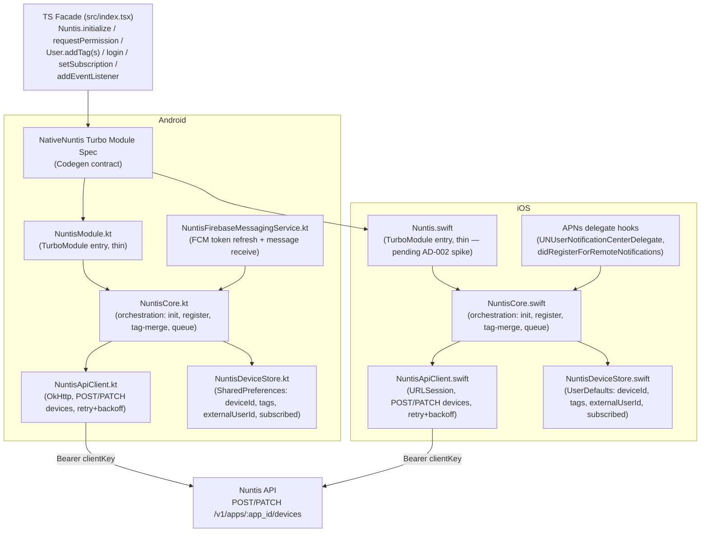

# SDK Core v1 Design

**Spec**: `.specs/features/sdk-core-v1/spec.md`
**Status**: Approved

---

## Architecture Overview

Native-heavy split (AD-001): Kotlin and Swift each own the full behavior — token acquisition, HTTP calls to Nuntis, retry/backoff, tag-merge cache, notification receive/click detection. The Turbo Module (`NativeNuntis`) is the only bridge; the TS layer (`src/index.tsx`) is a thin facade that calls into it and re-exposes native events as a JS-friendly `addEventListener` API. No business logic lives in TS.



Each platform independently satisfies the same spec ACs (SDK-01 through SDK-19) against the same Nuntis API contract — there is no shared Kotlin/Swift code (see Risks & Concerns for how this duplication is kept honest).

---

## Code Reuse Analysis

### Existing Components to Leverage

| Component | Location | How to Use |
| --- | --- | --- |
| `NativeNuntis` TurboModule spec skeleton | `src/NativeNuntis.ts` | Replace the scaffolded `multiply(a, b)` placeholder with the real v1 method surface (Data Models below) |
| `NuntisModule.kt` / `Nuntis.h` + `Nuntis.mm` | `android/src/main/java/com/nuntis/`, `ios/` | Replace placeholder bodies; keep the TurboModule registration scaffolding (`NAME`, `getTurboModule`) as-is |
| Nuntis API device contract | `zeep-nuntis` `internal/api/devices_handlers.go`, `design.md` | Both native clients implement this contract directly — no gateway/BFF in between |
| AD-009 (Client-key ownership proof) | `zeep-nuntis` `.specs/STATE.md` | Every `PATCH` from either native client must include the device's own cached `token` field |

### Integration Points

| System | Integration Method |
| --- | --- |
| Nuntis REST API | Direct HTTPS calls from native code (Android: OkHttp bundled via `react-native`'s existing transitive dependency; iOS: `URLSession`, no extra dependency), `Authorization: Bearer {clientKey}` |
| Firebase Cloud Messaging | `com.google.firebase:firebase-messaging` Android dependency + `google-services.json` (host app owns the file; Expo config plugin wires the Gradle plugin) |
| Apple Push Notification service | Native `UserNotifications` framework + host app's own APNs entitlement/capability (SDK cannot provision this — documented as an integrator prerequisite) |

---

## Components

### `NativeNuntis` (TurboModule Spec)

- **Purpose**: Codegen contract between JS and native — the only cross-language boundary.
- **Location**: `src/NativeNuntis.ts`
- **Interfaces** (see Data Models for shared payload shapes):
  - `initialize(appId: string, clientKey: string): void`
  - `requestPermission(): Promise<boolean>`
  - `login(externalUserId: string): void`
  - `logout(): void`
  - `addTags(tags: {[key: string]: string}): void`
  - `removeTags(keys: string[]): void`
  - `setSubscription(enabled: boolean): void`
  - Codegen events: `onNotificationReceived(payload: NotificationPayload)`, `onNotificationClicked(payload: NotificationPayload)`
- **Dependencies**: React Native Codegen (New Architecture), platform native implementations below.
- **Reuses**: scaffolded Spec file structure from `create-react-native-library`.

### `NuntisCore` (Android: `.kt`, iOS: `.swift` — independent implementations, same contract)

- **Purpose**: Orchestrates init, device registration, token refresh, tag-merge, and serializes outgoing `PATCH` calls (spec P3-AC8).
- **Location**: `android/src/main/java/com/nuntis/NuntisCore.kt`, `ios/NuntisCore.swift`
- **Interfaces** (internal, called by the thin TurboModule entry class):
  - `initialize(appId, clientKey)` — no-ops on repeat calls with identical args (SDK-07); fetches current push token and calls `registerDevice`.
  - `registerDevice(token, platform)` — `POST` upsert, retry per Tech Decisions below.
  - `onTokenRefreshed(newToken)` — re-invokes `registerDevice`.
  - `requestPermission()` → native OS prompt, then `PATCH {subscribed}`.
  - `mutateTags(add: Map?, remove: List<String>?)` — merges against the cached tag map, enqueues one `PATCH`.
  - `setExternalUserId(id | null)`, `setSubscription(bool)` — enqueue one `PATCH` each.
- **Dependencies**: `NuntisApiClient`, `NuntisDeviceStore`.
- **Reuses**: n/a (new).

### `NuntisApiClient` (Android: OkHttp, iOS: `URLSession`)

- **Purpose**: Talks to Nuntis' `/v1/apps/{app_id}/devices` endpoints; owns retry/backoff.
- **Location**: `android/src/main/java/com/nuntis/NuntisApiClient.kt`, `ios/NuntisApiClient.swift`
- **Interfaces**:
  - `createOrUpdateDevice(token, platform): Result<DeviceResponse>` — `POST`, upsert semantics per Nuntis contract.
  - `patchDevice(deviceId, body): Result<DeviceResponse>` — `PATCH`, always includes the cached `token` field (AD-009 ownership proof).
- **Dependencies**: `appId`/`clientKey` from `NuntisCore`, `NuntisDeviceStore` for the device id and last-known token.
- **Reuses**: n/a (new); intentionally does not reuse any existing HTTP client already in the RN dependency tree beyond OkHttp (Android's existing transitive dep).

### `NuntisDeviceStore` (Android: `SharedPreferences`, iOS: `UserDefaults`)

- **Purpose**: Persists device id, last-registered token, cached tag map, external user id, and subscribed flag across process restarts — the FCM/APNs delivery path can run in a different process lifecycle than the RN JS engine, so this cannot be in-memory-only like the spec's tag-mutation queue (Edge Case: in-flight-queue drop on kill is explicitly in-memory-only and separate from this persisted state).
- **Location**: `android/src/main/java/com/nuntis/NuntisDeviceStore.kt`, `ios/NuntisDeviceStore.swift`
- **Interfaces**: `get()/set()` per field; `mergeTags(add, remove): Map<String,String>` (pure function, unit-testable per platform).
- **Dependencies**: platform storage APIs only.
- **Reuses**: n/a (new).

### `NuntisFirebaseMessagingService` (Android only)

- **Purpose**: Receives FCM token refresh (`onNewToken`) and foreground data/notification messages (`onMessageReceived`); Nuntis always sends a `notification` payload (confirmed in `zeep-nuntis`'s `internal/providers/fcm/fcm.go`), so Android's system tray auto-displays it while the app is backgrounded/killed — `onMessageReceived` only fires reliably in the foreground, per standard FCM notification-message behavior. `onNotificationClicked` for a backgrounded/killed-state tap is instead detected by reading the launching `Intent`'s extras in the module's Activity-lifecycle hook.
- **Location**: `android/src/main/java/com/nuntis/NuntisFirebaseMessagingService.kt`
- **Interfaces**: standard `FirebaseMessagingService` overrides; forwards into `NuntisCore`/emits Codegen events.
- **Dependencies**: `com.google.firebase:firebase-messaging`, registered in `AndroidManifest.xml` (Expo config plugin injects this; bare RN integrators add it manually per README).
- **Reuses**: n/a (new).

### iOS APNs delegate hooks

- **Purpose**: iOS equivalent of the FCM service — receives the APNs device token (`application(_:didRegisterForRemoteNotificationsWithDeviceToken:)`) and foreground/background/click notification callbacks (`UNUserNotificationCenterDelegate`).
- **Location**: `ios/` — confirmed by T3 as a public entry point (e.g. `Nuntis.didRegisterForRemoteNotifications(deviceToken:)` / a `UNUserNotificationCenterDelegate`-conforming helper) that the **host app's own `AppDelegate` must call**, not a swizzled/zero-code hook (see T3 confirmation below).
- **Dependencies**: host app's own APNs capability/entitlement (documented integrator prerequisite, not something the SDK can provision); host app's own `AppDelegate` forwarding the APNs callbacks into the SDK (T3 — a second, code-level integrator prerequisite beyond the entitlement).
- **Reuses**: n/a (new).

**APNs wiring approach — confirmed T3 (2026-09-05):**

Context7 MCP was unavailable in this environment (same as T2), so this spike used web search over community/vendor sources — no single official Apple or Meta document states "third-party SDKs should/shouldn't swizzle push delegate methods," since swizzling is a runtime technique outside what either vendor's official app-lifecycle docs describe.

Findings that drove the decision:
- Swizzling `AppDelegate`/`UNUserNotificationCenterDelegate` methods to get zero-integrator-code push registration is a real, working pattern — used by Firebase (`GoogleUtilities/AppDelegateSwizzler`), Leanplum, and others.
- It is also a documented source of real conflicts: Firebase ships a documented opt-out (`FirebaseAppDelegateProxyEnabled = NO`) precisely because its own swizzling proxy can consume APNs callbacks before the host app or another SDK sees them; Bloomreach's SDK dropped swizzling-based auto-registration for reliability reasons (both found via web search, cited in this repo's T3 research).
- Whether swizzling interacts safely with RN's New Architecture Bridgeless mode (default since RN 0.74) is **not confirmed by any source found** — this was the exact gap AD-002 flagged as needing confirmation before Phase 3 could safely build against it, and it remains unconfirmed after this spike.

**Decision**: iOS APNs wiring requires explicit `AppDelegate` forwarding by the host app — no method swizzling. This is the conservative choice given (a) the crash-safety/reliability bar this SDK's spec sets, (b) a real precedent of swizzling-based conflicts among push SDKs, and (c) no source confirming swizzling's interaction with Bridgeless mode. It trades OneSignal-style zero-code integration for a small, explicit, documented `AppDelegate` snippet (written up in T19's README) — the same trade Apple's own supported integration path already assumes (delegate conformance is how any push provider is meant to be wired). Phase 3 (T15) implements the SDK's side of this contract: a small set of public static/class methods the host app's `AppDelegate` calls into, not a swizzled hook.

**Swift Turbo Module bridging — confirmed T2 (2026-09-05):**

React Native's own Turbo Native Modules docs (`reactnative.dev/docs/next/turbo-native-modules-introduction`, fetched directly) document only an Objective-C++ (`.mm`) implementation class and do not mention Swift at all — there is no official Meta-documented path for a Swift-implemented Turbo Module. Context7 MCP was not available in this environment (no matching tool registered), so this spike relied on the official-docs fallback plus an actual, real build as the deciding evidence (not a design read).

Mechanism, empirically confirmed by a real `pod install` + `react-native build-ios --mode Debug` (RN 0.85.0, Xcode 26.6) succeeding in this repo:

- The Obj-C++ scaffold (`ios/Nuntis.mm`/`ios/Nuntis.h`) stays as the thin TurboModule entry: it still implements `getTurboModule:` and `moduleName` (required — this is the one piece that must stay Obj-C++, since `getTurboModule:` returns a C++ `std::shared_ptr`, which Swift cannot express directly against the Codegen'd C++ JSI class).
- The actual method bodies move to a plain Swift class (`ios/NuntisImpl.swift`), exposed back to Obj-C++ via `@objc(ClassName) public class ... : NSObject`.
- `Nuntis.mm` imports the auto-generated `"Nuntis-Swift.h"` header (not a manual bridging header — bridging headers are an app-target mechanism; a CocoaPods pod's own Swift sources are exposed to its own Obj-C++ sources via this auto-generated umbrella header instead) and delegates each method one line into an instance of the Swift class.
- `Nuntis.podspec` must declare `s.swift_version` explicitly (added: `"5.9"`) — CocoaPods refuses to `pod install` a pod containing Swift files without it.

This pattern matches (and is corroborated by) several independent 2025 community write-ups (e.g. "Creating Turbo Modules in React Native with Swift", "Build Native and Turbo Modules in React Native with Swift" — both Medium, found via web search) that converge on the same Obj-C++-shim-plus-Swift-class shape, but it is **not** an officially documented Meta pattern. AD-002 is resolved as "active-confirmed by spike" (see `.specs/STATE.md`) on that basis — confirmed by working code and cross-referenced community consensus, not by an authoritative React Native doc, and that distinction is preserved here rather than overstated.

Spike files (kept, since the mechanism is confirmed working): `ios/NuntisImpl.swift` (placeholder `multiply` body only — T14 replaces this with the real Spec delegation), `ios/Nuntis.mm` (updated to delegate into `NuntisImpl`), `Nuntis.podspec` (`swift_version` added).

---

## Data Models

### `NotificationPayload` (TS + Kotlin + Swift — same shape, defined independently per platform per AD-001)

```typescript
interface NotificationPayload {
  title?: string;
  body?: string;
  data?: { [key: string]: string }; // arbitrary custom key/value from Nuntis' compose "Configurações avançadas"
}
```

**Relationships**: Emitted as-is from the FCM/APNs payload; the SDK does not interpret or route on `data` contents (spec's Out of Scope: deep-link routing is the integrator's job).

### `DeviceState` (persisted in `NuntisDeviceStore`, not exposed to JS directly)

```typescript
interface DeviceState {
  deviceId: string | null;
  lastToken: string | null;
  tags: { [key: string]: string };
  externalUserId: string | null;
  subscribed: boolean;
}
```

**Relationships**: One instance per app install (per `(appId, clientKey)` pair); mirrors the Nuntis `Device` row this install owns.

---

## Error Handling Strategy

| Error Scenario | Handling | User Impact |
| --- | --- | --- |
| Missing/invalid `appId`/`clientKey` at `initialize()` (SDK-03) | Native code logs an error via platform logger (`Log.e` / `os_log`), returns without throwing | No crash; no registration; silent from the JS caller's perspective (matches spec — `initialize` has no return value to reject) |
| Missing native push prerequisite (SDK-04) | Native code catches the specific missing-config exception/error (e.g. Firebase's own "no google-services.json" failure, or a nil APNs environment) and logs, does not propagate | No crash; push simply doesn't initialize |
| Registration HTTP failure (SDK-05) | `NuntisApiClient` retries with exponential backoff, capped at 5 attempts, per-platform `Handler`/`DispatchQueue` timer — no shared code, so **this exact policy (base delay, multiplier, jitter or not) must be pinned as a Tech Decision below and implemented identically on both platforms**, or the two clients will observably diverge | No user-visible impact; device just registers late |
| `requestPermission()` called before `initialize()` (Edge Case) | Native code logs an error, does not prompt | No native permission dialog appears |
| Queued tag/subscription mutation, app killed before it sends (Edge Case) | In-memory queue is lost on process death by design — no persistence attempted | The most recent mutation before kill is not applied; documented as accepted v1 behavior |

---

## Risks & Concerns

| Concern | Location (file:line) | Impact | Mitigation |
| --- | --- | --- | --- |
| Two independent native implementations (Kotlin + Swift) of the same retry/tag-merge/queue contract, no shared code (AD-001) | `android/src/main/java/com/nuntis/NuntisCore.kt`, `ios/NuntisCore.swift` (not yet created) | Behavioral drift between platforms is easy to introduce silently — e.g. one platform's retry backoff diverges from the other's, or tag-merge edge cases (empty string value, key collision) are handled differently | Tasks phase must include a **parallel platform test matrix**: the same behavioral scenarios (from spec ACs) written once as a checklist, then implemented as both an Android instrumented test and an iOS XCTest — not just "tests exist," but the same scenario list run on both, checked off together per task |
| Swift Turbo Module Codegen bridging mechanism unconfirmed (AD-002) | `ios/Nuntis.h`, `ios/Nuntis.mm` (current Obj-C scaffold) | Blocks all iOS implementation work until resolved; wrong assumption here would require re-scaffolding iOS from scratch | First Tasks-phase task is a research spike (Context7 + official RN docs), validated by an actual Xcode build (not just a design read), before any push logic is written |
| iOS APNs wiring approach (swizzling vs. required `AppDelegate` integration code) unconfirmed | `ios/` (not yet created) | Determines whether bare-RN integrators need to add code to their own `AppDelegate`, which is a real integration-surface decision affecting the README/quickstart | Folded into the same AD-002 spike — resolve before writing the integrator-facing setup instructions |
| Nuntis' FCM messages always include a `notification` block (confirmed in `zeep-nuntis/internal/providers/fcm/fcm.go:130-136`) | External dependency, not this repo | `onMessageReceived` won't reliably fire in background/killed states (standard FCM behavior) — a naive implementation might assume it always fires and miss background-click detection | Design already accounts for this: background/killed click detection reads the launch `Intent` extras instead of relying on `onMessageReceived` (see `NuntisFirebaseMessagingService` component) |
| No backend rate limiting/key scoping yet (`zeep-nuntis` roadmap: public-API hardening is unstarted) | `zeep-nuntis` (external) | A buggy retry loop in either native client could hammer Nuntis' API with no server-side backstop | Out of this feature's scope per spec (deferred to `public-api-hardening`), but the 5-attempt retry cap (SDK-05) is itself a client-side backstop worth keeping conservative for this reason |

---

## Tech Decisions (only non-obvious ones)

| Decision | Choice | Rationale |
| --- | --- | --- |
| Retry backoff parameters | Base delay 2s, ×2 multiplier, capped at 5 attempts (2s, 4s, 8s, 16s, 32s), no jitter | Simple, deterministic, easy to implement identically on both platforms without a shared library — jitter adds cross-platform-parity risk for negligible v1 benefit at this scale |
| Persisted store choice | `SharedPreferences` (Android) / `UserDefaults` (iOS) rather than a database (Room/CoreData) | `DeviceState` is a handful of scalar fields plus a small tag map — no query needs, no relational structure; matches what OneSignal's own SDK uses for the same class of state |
| HTTP client choice | OkHttp (Android, already a transitive RN dependency) / `URLSession` (iOS, no dependency) | Avoids adding a new third-party HTTP dependency on either platform |
| Codegen event mechanism | Turbo Module Codegen-declared events (`onNotificationReceived`/`onNotificationClicked` in the Spec) rather than `RCTDeviceEventEmitter`/`NativeEventEmitter` classic-bridge pattern | New Architecture-native approach; avoids depending on the (still-supported but legacy-flavored) classic emitter API for a brand-new Turbo Module |

> AD-001 and AD-002 (both project-level, cross-cutting) are already recorded in `.specs/STATE.md`.
