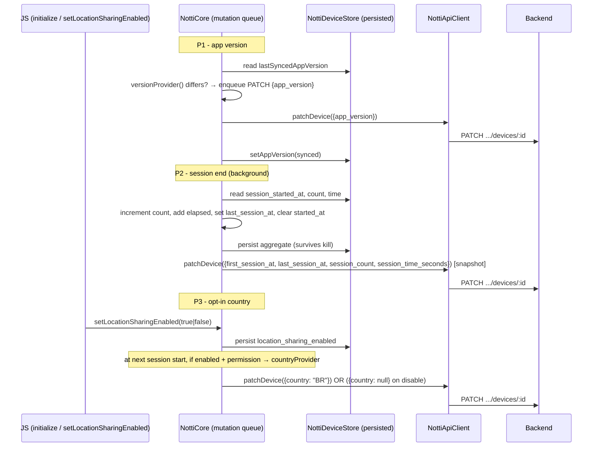

# Segment Telemetry Reporting Design

**Spec**: `.specs/features/segment-telemetry-reporting/spec.md`
**Context**: `.specs/features/segment-telemetry-reporting/context.md`
**Status**: Draft

---

## Architecture Overview

The feature is native-only bookkeeping on both platforms, synced to the backend through the
**existing device PATCH mutation-queue path** (`NottiCore`'s `pendingMutations` on both platforms) —
no new transport, no per-session request storm. Three stories share that single pipeline:

- **P1 (app_version)**: a static string read once per launch, diffed against the last value
  successfully synced, and enqueued as a PATCH only when it changed.
- **P2 (session lifecycle)**: foreground/background hooks that accumulate four aggregate fields
  (`first_session_at`/`last_session_at`/`session_count`/`session_time`) into `NottiDeviceStore`
  (persisted, survives process death), enqueued as a PATCH on session end via a captured snapshot.
- **P3 (country)**: an explicit JS opt-in toggle (the one deliberate `AD-001` exception) persisted in
  `NottiDeviceStore`; at session start, a best-effort, permission-gated country read is enqueued as a
  PATCH; disabling enqueues a `country: null` clear.

The critical constraint driving this design: **`NottiCore` has no `Context`/app-visible state** — it
receives everything through constructor-injected closures (the same `tokenProvider`/`permissionRequester`
pattern already in place on both platforms). New platform reads (version, location permission, country
resolution) are injected as closures too, keeping `NottiCore` testable without Robolectric/CoreLocation.



---

## Code Reuse Analysis

### Existing Components to Leverage

| Component | Location | How to Use |
| --- | --- | --- |
| `pendingMutations` + `mutate()`/`performOrQueue` (diff-and-enqueue mutation queue) | `android/NottiCore.kt:360-411`, `ios/NottiCore.swift:407-435` | The single pipeline all three stories PATCH through. Session/version/country mutations are just new `PendingMutation`s following the identical shape (`mutate("op") { client, deviceId, token -> client.patchDevice(...); setter on Success }`). |
| `NottiApiClient.patchDevice(deviceId, token, fields)` | `android/NottiApiClient.kt:89-114`, `ios/NottiApiClient.swift:154-184` | Already accepts an open `Map`/`[String: Any]` of fields and always adds `token` (AD-009). New keys (`app_version`, `first_session_at`, `last_session_at`, `session_count`, `session_time_seconds`, `country`) need zero transport changes. |
| Raw-JSON null support | `android/NottiApiClient.kt:176-185` (`toJsonValue(null)` → `JSONObject.NULL`), iOS `JSONSerialization` handles `NSNull` | `country: null` (P3 clear, SEGTEL-13/DEVTEL-06-08) serializes correctly on both platforms — same three-state technique the backend companion spec's PATCH requires. |
| `NottiDeviceStore`/`NottiDeviceStore.swift` (SharedPreferences/UserDefaults scalar state) | `android/NottiDeviceStore.kt`, `ios/NottiDeviceStore.swift` | Extended with the new persisted fields (app version last-synced, session aggregate, location opt-in flag). Same backing store (`notti_prefs`) the CTR event queue uses for durability — satisfies P2-AC5 "same on-disk store". |
| `NottiForegroundObserver` (`ProcessLifecycleOwner` `onStart`) | `android/NottiInitProvider.kt:98-101` | Extended with `onStop` → `activeCore?.onAppBackgrounded()` — today there is **no** background hook on Android; this is the P2 session-end trigger. |
| `observeAppForeground()` (`didBecomeActiveNotification` observer) | `ios/NottiCore.swift:334-344` | The existing foreground hook is the P2 session-start trigger on iOS. A mirrored `didEnterBackgroundNotification` observer is added for session end. |
| `tokenProvider`/`permissionRequester` injection pattern | `android/NottiCore.kt:45-56`, `ios/NottiCore.swift:35-37` | New `versionProvider`/`countryProvider`/`hasLocationPermission` closures follow the same constructor-injection pattern — `NottiCore` stays `Context`-free and unit-testable. |
| `requestPermission`/`permissionRequester` | `android/NottiCore.kt:281-312`, `ios/NottiCore.swift:147-179` | P3 does **not** reuse this (it must never prompt) — but the `permissionRequester`-style injection proves the pattern for the new `hasLocationPermission` check-only closure. |
| `NottiEventStore`'s snapshot/enqueue-then-flush shape | `android/NottiEventStore.kt`, `ios/NottiEventStore.swift` | The edge case "no double-count when a new session starts mid-flush" is solved by capturing session fields **at enqueue time** into the mutation closure — same capture-at-enqueue shape `mutateTags` already uses (`merged` computed before `runOrQueue`). |

### Integration Points

| System | Integration Method |
| --- | --- |
| PATCH device endpoint (P1/P2/P3 payloads) | Existing `patchDevice` — new keys are additive; backend companion spec (closed) accepts them, and the "SDK ships before backend" edge case is tolerated (unknown fields silently ignored). |
| Backend segment fields | The SDK only produces the data; filtering (`hours_ago` etc.) is entirely `device-telemetry-fields`' P2, out of scope here. |
| Host app version | Injected `versionProvider` closure: Android `context.packageManager.getPackageInfo(packageName, 0).versionName`, iOS `Bundle.main.infoDictionary["CFBundleShortVersionString"]` — never crashes the SDK if absent (returns `null`). |
| OS location permission | Injected `hasLocationPermission` closure: Android `ContextCompat.checkSelfPermission`, iOS `CLLocationManager.authorizationStatus` — check-only, never prompts. |
| Country resolution | Injected `countryProvider(callback)` closure: Android `LocationManager.getLastKnownLocation` + `Geocoder.getFromLocation(...).countryCode`, iOS `CLLocationManager().location` + `CLGeocoder.reverseGeocodeLocation(...).isoCountryCode` — best-effort, async, may return `null`. |

---

## Components

### P1 — `NottiCore.syncAppVersionIfNeeded()` (both platforms)

- **Purpose**: read the current app version once per launch and enqueue a PATCH if it differs from the last successfully synced value.
- **Location**: `android/NottiCore.kt` (new private method, called from `registerDevice` success after `flushPendingMutations`), `ios/NottiCore.swift` (same).
- **Interfaces**:
  - `versionProvider: () -> String?` (constructor-injected) — returns current app version or `null` on failure.
  - `deviceStore.getAppVersion()/setAppVersion(String?)` — last-synced value.
- **Dependencies**: `NottiDeviceStore` new fields, `versionProvider` closure.
- **Reuses**: `mutate`/`performOrQueue` + `patchDevice`.
- **Behavior**: if `versionProvider()` returns `null`, skip entirely (SEGTEL edge: no crash, no registration block). If it differs from `getAppVersion()`, `mutate("appVersion") { client, deviceId, token -> client.patchDevice(deviceId, token, mapOf("app_version" to current)); on Success -> deviceStore.setAppVersion(current) }`. Opaque string, no semver parsing (SEGTEL-04).

### P2 — Session lifecycle (both platforms)

- **Purpose**: track foreground→background cycles into persisted aggregate fields and sync them via the mutation queue.
- **Location**: `android/NottiCore.kt` (`handleSessionStart`/`handleSessionEnd`), `ios/NottiCore.swift` (same), `android/NottiInitProvider.kt` (background observer), `ios/NottiCore.swift` (background observer).
- **Persisted fields (new, in `NottiDeviceStore`)**:
  - `first_session_at` (epoch ms, `Long?`) — set once, never overwritten (matches backend DEVTEL-03 NULL-guard).
  - `last_session_at` (epoch ms, `Long?`).
  - `session_count` (`Int`, default 0).
  - `session_time_ms` (`Long`, default 0) — cumulative foreground time; payload sends seconds.
  - `session_started_at` (epoch ms, `Long?`) — current in-flight session, `null` when no session active.
- **`handleSessionStart(nowMs)`** (called from `onAppForegrounded`/`handleAppDidBecomeActive`, before the existing flush/retry logic):
  1. If `session_started_at != null` → **unclean kill detected** (force-quit/crash without background transition): close the missed session via `endSession` with the stored `session_started_at` as start and `nowMs` as end (SEGTEL-08 AC4 estimate; agent discretion — documented below).
  2. If `first_session_at == null` → `setFirstSessionAt(nowMs)` (SEGTEL-05 AC1).
  3. `setSessionStartedAt(nowMs)`.
- **`handleSessionEnd(nowMs)`** (called from `onAppBackgrounded`/`didEnterBackgroundNotification`):
  1. If `session_started_at == null` → no-op (no active session; also naturally excludes widget/extension/background-fetch invocations, which never set `session_started_at`).
  2. Else: `count += 1`, `session_time += nowMs - startedAt`, `last_session_at = nowMs`, `session_started_at = null`; persist all (SEGTEL-06 AC2, survives kill per AC5).
  3. **Enqueue session mutation with a captured snapshot** of the four aggregate fields (SEGTEL-07 AC3, edge case "no double-count mid-flush"): `mutate("session") { client, deviceId, token -> client.patchDevice(deviceId, token, snapshot); on Success -> no-op (backend is sink) }` where `snapshot` is `{first_session_at: iso(first), last_session_at: iso(last), session_count, session_time_seconds: ms/1000}` computed at enqueue time.
- **Dependencies**: `NottiDeviceStore` session fields, ISO-8601 formatting helper, the two lifecycle hooks below.

### Lifecycle hooks (new)

| Platform | Session start (exists today) | Session end (NEW) |
| --- | --- | --- |
| Android | `NottiForegroundObserver.onStart` → `NottiModule.activeCore?.onAppForegrounded()` (`NottiInitProvider.kt:98-101`) | **NEW** `NottiForegroundObserver.onStop` → `NottiModule.activeCore?.onAppBackgrounded()`; `onAppBackgrounded()` (new `NottiCore` method) dispatches `handleSessionEnd(now)` on the core executor. |
| iOS | `observeAppForeground()` → `handleAppDidBecomeActive()` (`NottiCore.swift:334-344`) | **NEW** `observeAppBackground()` on `UIApplication.didEnterBackgroundNotification` → `handleAppDidEnterBackground()` → `handleSessionEnd(now)` on the workQueue. |

Both are zero-integration (no AppDelegate forwarding) — the same mechanism the existing foreground hook uses.

### P3 — Location opt-in country

- **Purpose**: opt-in reverse-geocoded `country` (ISO 3166-1 alpha-2), permission-gated, never prompting.
- **JS surface** (the one deliberate `AD-001` exception, SEGTEL-10 AC1):
  - `src/NativeNotti.ts`: `Spec.setLocationSharingEnabled(enabled: boolean): void`.
  - `src/index.tsx`: `function setLocationSharingEnabled(enabled: boolean): void` → `NativeNotti.setLocationSharingEnabled(enabled)`; exposed on the exported `Notti` object (the actual export is `Notti`, not `ZeepNotti` — context.md's name refers to the method, the receiver is the existing default export).
  - Chain: JS → codegen → `NottiModule.kt` override → `NottiCore.setLocationSharingEnabled(enabled)`; iOS `Notti.mm` → `NottiImpl.setLocationSharingEnabled(_:)` → `NottiCore.setLocationSharingEnabled(_:)`.
- **Persisted field (new, `NottiDeviceStore`)**: `location_sharing_enabled` (`Boolean`, default `false`), survives restarts (SEGTEL-15 AC6).
- **`NottiCore.setLocationSharingEnabled(enabled)`**:
  - Persist the flag.
  - If `false`: enqueue PATCH `{country: null}` to explicitly clear any previously-synced value (SEGTEL-13 AC4) — never just stop sending.
  - If `true`: no immediate read; the next session start attempts it.
- **Session-start read** (in `handleSessionStart`, after session bookkeeping): if `deviceStore.getLocationSharingEnabled()` and `hasLocationPermission()` → `countryProvider { country -> dispatch { if still enabled && country != null -> mutate PATCH {country}; else -> omit } }`. Failure/permission-revoked mid-read → omit, no crash, no prompt (SEGTEL-11/12/14 AC2/3/5). Stale cached fix is acceptable (edge case).
- **Dependencies**: `hasLocationPermission` (check-only) + `countryProvider(callback)` (async) injected closures, `NottiDeviceStore` flag.

### ISO-8601 formatting helper

- **Android**: no `java.time` (minSdk 24, no desugaring) → `SimpleDateFormat("yyyy-MM-dd'T'HH:mm:ss.SSS'Z'", Locale.US)` with UTC `TimeZone`, fed epoch ms. A small `internal fun formatIsoUtc(epochMs: Long): String` in `NottiCore.kt` (or a new `NottiTelemetry.kt`).
- **iOS**: `ISO8601DateFormatter` (UTC) or `DateFormatter` with `en_US_POSIX` locale, `yyyy-MM-dd'T'HH:mm:ss.SSS'Z'`, UTC — matching the Android shape so the backend's Go RFC3339 parse accepts both.

---

## Data Models

### `NottiDeviceStore.DeviceState` (both platforms — extended)

```kotlin
data class DeviceState(
  val deviceId: String?,
  val lastToken: String?,
  val tags: Map<String, String>,
  val externalUserId: String?,
  val subscribed: Boolean,
  // --- NEW (segment telemetry) ---
  val appVersion: String?,           // last successfully synced app version (P1)
  val firstSessionAtMs: Long?,       // set once, never overwritten (P2)
  val lastSessionAtMs: Long?,        // last session end (P2)
  val sessionCount: Int,             // running total (P2)
  val sessionTimeMs: Long,           // cumulative foreground ms (P2)
  val sessionStartedAtMs: Long?,     // in-flight session, null when idle (P2)
  val locationSharingEnabled: Boolean, // P3 opt-in flag, default false
)
```

### PATCH payload keys (all additive, backend `device-telemetry-fields` closed)

```json
{ "app_version": "1.2.3",
  "first_session_at": "2026-09-30T20:05:00.000Z",
  "last_session_at": "2026-09-30T21:00:00.000Z",
  "session_count": 42,
  "session_time_seconds": 3600,
  "country": "BR" }
```

`country: null` is the explicit clear (three-state presence the companion PATCH requires).

---

## Error Handling Strategy

| Error Scenario | Handling | User Impact |
| --- | --- | --- |
| Version reader fails (no `PackageInfo`/`CFBundleShortVersionString`) | `versionProvider()` returns `null`; `syncAppVersionIfNeeded` skips | No `app_version` in payload until a launch where it reads; no crash, no registration block (SEGTEL edge). |
| Session start on a previously-killed process | `session_started_at` non-null → estimate the missed session (count +1, time += now − startedAt) at next launch | Aggregate converges instead of under-counting forever (SEGTEL-08). |
| Background event with no active session (widget/extension/background-fetch) | `session_started_at == null` → no-op | No inflated `session_count` from non-interactive wake-ups (SEGTEL edge). |
| Location opt-in off, or permission not granted, or read fails | No `country` field in payload; never prompt, never error | Zero payload/behavior change for non-opted-in integrators (SEGTEL-12/14). |
| Opt-out after having synced country | PATCH `{country: null}` enqueued immediately | Server value cleared, not just stale (SEGTEL-13). |
| `countryProvider` fires after toggle flipped off mid-read | Re-check flag at callback time → omit | No stale country sent after opt-out (SEGTEL-12). |

---

## Tech Decisions

| Decision | Choice | Rationale |
| --- | --- | --- |
| New JS API | `Notti.setLocationSharingEnabled(enabled)` — the ONLY JS-visible change in this feature | Deliberate, documented `AD-001` exception for the privacy-critical opt-in (SEGTEL-10). |
| Session/version/country persisted state location | Extend `NottiDeviceStore` (same `notti_prefs`/UserDefaults suite the CTR event queue uses) | P2-AC5 durability satisfied by the same on-disk store; scalar aggregate fits `DeviceStore`'s existing shape better than a queue store. |
| `java.time` on Android | Avoided entirely — epoch ms internally, `SimpleDateFormat`(UTC) only at payload build | minSdk 24 + no desugaring; `java.time` (API 26+) would crash on device while passing JVM tests. |
| Background detection | Android `ProcessLifecycleOwner.onStop`; iOS `didEnterBackgroundNotification` | Mirrors the existing zero-integration foreground hooks; no AppDelegate forwarding, no integrator code. |
| Unclean-kill estimate | Missed session closes at next launch's `handleSessionStart` using `now − session_started_at` | Matches "last known foreground timestamp to estimate contribution"; avoids forever under-count (SEGTEL-08). |
| Country precision | Country code only (ISO 3166-1 alpha-2), no raw lat/long | Per confirmed context.md decision; matches backend companion spec's `country` column. |
| `countryProvider` injection | Async `(callback: (String?) -> Unit) -> Unit` closure per platform | Keeps `NottiCore` Context-free and testable; permission-gating + geocode live inside the platform provider. |
| Session mutation snapshot | Fields captured at enqueue time into the closure | Prevents double-count when a new session starts mid-flush (edge case); same capture-at-enqueue shape as `mutateTags`. |
| `first_session_at` semantics | Set once locally (null-guard) + backend DEVTEL-03 guard | Double protection against a buggy build overwriting true first-session history. |

---

## Requirements → Design Mapping

| Req | Design |
| --- | --- |
| SEGTEL-01 (read version at init, hold in device state) | `versionProvider` read + `NottiDeviceStore.appVersion` |
| SEGTEL-02 (version in registration/flush payload) | `syncAppVersionIfNeeded` in `registerDevice` success → PATCH via mutation queue |
| SEGTEL-03 (diff-and-enqueue on version change) | `syncAppVersionIfNeeded` diffs `versionProvider()` vs stored `appVersion` |
| SEGTEL-04 (opaque string, no parsing) | No semver logic anywhere |
| SEGTEL-05 (foreground → session start, first_session_at) | `handleSessionStart` from `onAppForegrounded`/`handleAppDidBecomeActive` |
| SEGTEL-06 (background/terminate → session end, aggregate) | `handleSessionEnd` from new background hooks |
| SEGTEL-07 (session fields in next flush, batched) | Enqueue session PATCH via mutation queue on session end |
| SEGTEL-08 (unclean-kill estimate at next launch) | `handleSessionStart` closes stale `session_started_at` with estimate |
| SEGTEL-09 (session state survives process death) | Persisted in `NottiDeviceStore` (same on-disk store as CTR queue) |
| SEGTEL-10 (opt-in default off, JS toggle) | `setLocationSharingEnabled`, default `false` persisted |
| SEGTEL-11 (enabled + permission → read at session start → country) | Session-start `countryProvider` read |
| SEGTEL-12 (disabled OR no permission → omit field) | Flag check + `hasLocationPermission` gate; null → omit |
| SEGTEL-13 (toggle off → clear synced country) | Immediate PATCH `{country: null}` |
| SEGTEL-14 (never prompt; read failure = omit) | `hasLocationPermission` check-only; failure → omit, no error |
| SEGTEL-15 (opt-in persists across restarts) | Persisted `location_sharing_enabled` in `NottiDeviceStore` |

---

## Tips

- **Reuse the mutation queue** — every payload is a `PendingMutation` through `patchDevice`; never a new HTTP path.
- **Capture at enqueue** — session fields are snapshotted when the mutation is created, not read at flush.
- **Inject everything platform-y** — `NottiCore` stays `Context`-free: version, permission check, and country resolution all come in as closures.
- **No `java.time` on Android** — epoch ms + UTC `SimpleDateFormat` only.
- **Two new background hooks** — neither exists today; both mirror the existing zero-integration foreground hooks.